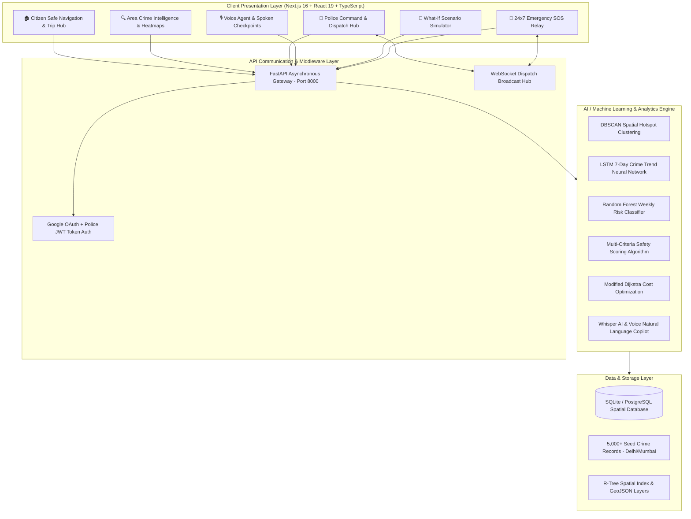
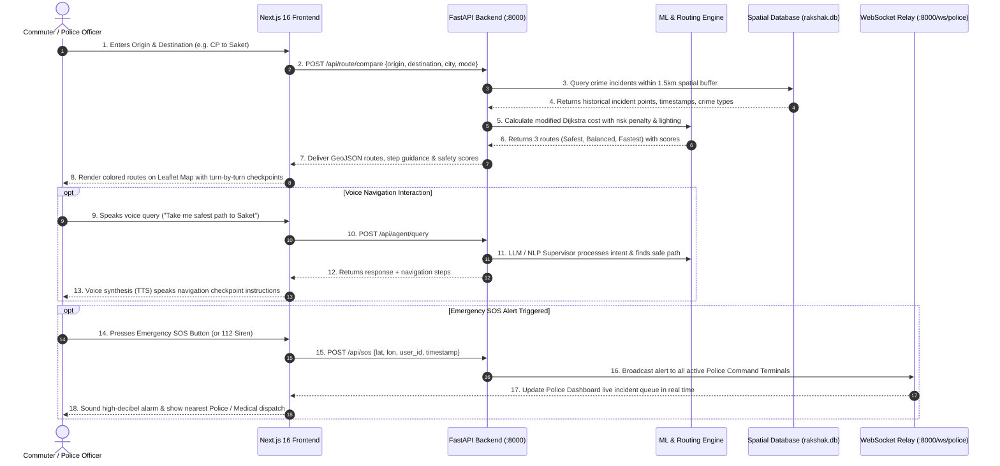

# 🛡️ Rakshak AI — Complete Public Safety & Route Intelligence Platform

[](https://nextjs.org/)
[](https://react.dev/)
[](https://fastapi.tiangolo.com/)
[](https://python.org/)
[](https://leafletjs.com/)
[](https://opensource.org/licenses/MIT)

> **Rakshak AI** is an end-to-end, real-time public safety intelligence ecosystem that combines spatial crime analytics, machine learning risk forecasting, dynamic 3-route safe navigation (Safest vs. Balanced vs. Fastest), interactive voice-guided checkpoint assistance, and 24x7 emergency response dispatch (Police ERSS 112 & Medical 108).

---

## 📑 Table of Contents
1. [🌟 Executive Summary & Mission](#-executive-summary--mission)
2. [🏗️ High-Level System Architecture](#️-high-level-system-architecture)
3. [🔄 Complete End-to-End Workflow](#-complete-end-to-end-workflow)
4. [📡 Complete API Specifications & Endpoints](#-complete-api-specifications--endpoints)
5. [🧠 Machine Learning Models & Algorithms](#-machine-learning-models--algorithms)
6. [📦 Micro-Modules & Subsystem Breakdown](#-micro-modules--subsystem-breakdown)
7. [🖥️ Frontend Pages & Portals](#️-frontend-pages--portals)
8. [⚙️ Environment Variables & Configuration](#️-environment-variables--configuration)
9. [🚀 Step-by-Step Local Setup & Run Guide](#-step-by-step-local-setup--run-guide)
10. [🔑 Demo Test Accounts & Credentials](#-demo-test-accounts--credentials)
11. [📂 Repository File Structure](#-repository-file-structure)

---

## 🌟 Executive Summary & Mission

Conventional navigation apps (Google Maps, Apple Maps, OpenStreetMap) route commuters based solely on **distance** or **travel time**. This frequently routes solo travelers, women, and late-night pedestrians through unlit alleys, high-theft corridors, or isolated industrial zones.

**Rakshak AI** recalculates routing physics by introducing safety as the primary routing constraint. By processing verified spatial crime records, street illumination density, CCTV infrastructure, and real-time emergency responder proximity, Rakshak AI delivers dynamic **Rakshak Safety Scores (0–100)** and real-time safe travel recommendations.

---

## 🏗️ High-Level System Architecture



---

## 🔄 Complete End-to-End Workflow



---

## 📡 Complete API Specifications & Endpoints

### 1. 🧭 Navigation & Routing APIs

| Endpoint | Method | Params / Payload | Description | Response Structure |
| :--- | :---: | :--- | :--- | :--- |
| `/api/route/compare` | `POST` | `{ origin: string, destination: string, city: string, mode?: string }` | Computes **Safest**, **Balanced**, and **Fastest** 3-route comparison with safety metrics. | `{ safest: Route, balanced: Route, fastest: Route, comparison_summary: string }` |
| `/api/route/safe` | `POST` | `{ origin: string, destination: string, city: string }` | Returns the single safest route with verified lighted corridors. | `{ route: GeoJSON, safety_score: number, waypoints: string[] }` |
| `/api/assistant/route-guidance` | `POST` | `{ city, coordinates, origin_name, dest_name, mode }` | Returns step-by-step turn-by-turn instructions with individual checkpoint safety ratings. | `{ steps: Array<{ step_index, title, guidance, safety_rating }> }` |
| `/api/eta/predict` | `POST` | `{ origin_lat, origin_lng, dest_lat, dest_lng, travel_mode, departure_time }` | Predicts accurate ETA adjusted for traffic, weather, and safety corridor detours. | `{ eta_minutes: number, distance_km: number, confidence: number }` |

---

### 2. 🔍 Crime Intelligence & Spatial Analytics APIs

| Endpoint | Method | Params / Payload | Description | Response Structure |
| :--- | :---: | :--- | :--- | :--- |
| `/api/crime-search` | `GET` | `?area=Saket&city=Delhi` | Comprehensive area safety report with breakdown, peak hours, and hotspots. | `{ area, safety_score, crime_breakdown, peak_hours, hotspots, heatmap, recommendations }` |
| `/api/cities` | `GET` | *None* | Returns supported cities, central coordinates, and geographic bounding boxes. | `{ cities: Array<{ name, center: [lat, lng], bounds, zoom }> }` |
| `/api/hotspots` | `GET` | `?city=Delhi&eps_km=0.5&min_samples=5` | Returns GeoJSON FeatureCollection of DBSCAN-generated hotspot polygons. | `{ type: "FeatureCollection", features: HotspotFeature[] }` |
| `/api/safety-heatmap` | `GET` | `?city=Delhi&grid_size=10` | Returns spatial density grid points with normalized intensity for heatmap overlays. | `{ heatmap: Array<{ lat, lng, intensity }> }` |
| `/api/safety-score` | `GET` | `?lat=28.5245&lon=77.2066&city=Delhi` | Computes live point safety score (0–100) with nearby incident counts and advice. | `{ safety_score: number, risk_level: string, nearby_incidents_count: number }` |
| `/api/forecast/{area}` | `GET` | Path variable `area` | Returns 7-day LSTM crime volume forecast and Random Forest weekly pattern. | `{ lstm: LSTMForecast, random_forest: WeeklyPattern }` |

---

### 3. 👮 Police Command & Patrol APIs

| Endpoint | Method | Params / Payload | Description | Response Structure |
| :--- | :---: | :--- | :--- | :--- |
| `/api/police/login` | `POST` | `{ officer_id: string, pin: string }` | Authenticates police officer badge credentials and issues auth session token. | `{ token: string, officer_id: string, role: "police_admin", message: string }` |
| `/api/police/dashboard` | `GET` | Headers: `Authorization: Bearer <token>` | Returns real-time police KPIs, crime stats, active hot clusters, and patrol metrics. | `{ active_hotspots: number, patrol_units: number, crime_stats: object, recent_incidents: [] }` |
| `/api/police/resource-allocation` | `GET` | Headers: `Authorization: Bearer <token>` | Recommends optimal allocation of PCR vans and motorcycle patrols to high-risk zones. | `{ allocations: Array<{ zone, recommended_vans, risk_weight }> }` |
| `/api/police/patrol-routes` | `GET` | Headers: `Authorization: Bearer <token>` | Generates optimized Dijkstra patrol routes connecting critical hotspot clusters. | `{ patrol_routes: Array<{ route_id, waypoints, total_distance_km, coverage_pct }> }` |
| `/ws/police` | `WebSocket` | Query `?token=<token>` | Real-time bidirectional WebSocket channel for instantaneous SOS broadcast alerts. | Live JSON Event Stream: `{ event: "SOS_TRIGGERED", lat, lon, user_name, timestamp }` |

---

### 4. 🎙️ AI Agent & Voice APIs

| Endpoint | Method | Params / Payload | Description | Response Structure |
| :--- | :---: | :--- | :--- | :--- |
| `/api/agent/query` | `POST` | `{ message: string, userId: string, userLocation: { latitude, longitude, city } }` | Supervisor AI Copilot reasoning endpoint for voice routing and spatial queries. | `{ reply: string, route?: object, toolCallsUsed: string[] }` |
| `/api/agent/chat` | `POST` | `{ message, city, history, admin_mode, confirmed_action }` | Natural language chat assistant supporting multi-turn dialogues and form autofill. | `{ response: string, action?: string, tool_audit_log: [] }` |
| `/api/agent/pre-journey-briefing` | `POST` | `{ origin_name, dest_name, city, time_of_day, mode }` | Generates a situational safety briefing before starting a journey. | `{ briefing_title, summary, critical_checkpoints: [], emergency_contacts: [] }` |

---

### 5. 🧪 Simulation & Emergency APIs

| Endpoint | Method | Params / Payload | Description | Response Structure |
| :--- | :---: | :--- | :--- | :--- |
| `/api/simulator/what-if` | `POST` | `{ source, destination, scenario: { departureTime, travelMode, lightingCondition, weatherCondition, policePatrol } }` | Multi-factor stress-testing: calculates baseline vs. simulated safety scores and deltas. | `{ baselineScore, simulatedScore, simulatedBand, scoreDelta, percentageChange, factors: [] }` |
| `/api/sos` | `POST` | `{ latitude: number, longitude: number, user_id?: string, reason?: string }` | Immediate emergency dispatch trigger logging incident and broadcasting via WebSockets. | `{ success: boolean, incident_id: string, message: string, dispatched_units: string[] }` |
| `/api/incidents/report` | `POST` | `{ crime_type, location_name, lat, lng, description, time_occurred }` | Citizen-submitted crime/hazard incident report queued for verification. | `{ status: "received", report_id: string }` |

---

### 6. 🕒 Journey History APIs

| Endpoint | Method | Params / Payload | Description | Response Structure |
| :--- | :---: | :--- | :--- | :--- |
| `/api/history` | `GET` | Headers or `?user_id=...` | Retrieves user's past saved journeys, timestamps, safety scores, and coordinates. | `{ history: Array<{ id, origin, destination, timestamp, safety_score, risk_tag }> }` |
| `/api/history` | `POST` | `{ origin, destination, origin_coords, dest_coords, safety_score, risk_tag }` | Saves a newly completed or planned journey to user trip history. | `{ success: boolean, trip_id: string }` |

---

## 🧠 Machine Learning Models & Algorithms

### 1. Spatial Hotspot Clustering (DBSCAN)
- **Algorithm**: Density-Based Spatial Clustering of Applications with Noise (DBSCAN)
- **Distance Metric**: Great Circle Haversine distance
- **Parameters**: Epsilon $\epsilon = 0.5\text{ km}$, $\text{min\_samples} = 5$
- **Output**: Generates convex hull polygon clusters of recurring incident zones with assigned severity weights.

### 2. Time-Series Crime Forecasting (LSTM Neural Network)
- **Architecture**: 2-Layer LSTM with Dropout (0.2) + Dense linear projection head.
- **Input**: 30-day sequential rolling window of aggregated daily incident counts.
- **Output**: 7-Day forward projection with Upper/Lower 95% Confidence Intervals ($\text{RMSE} < 1.42$, $R^2 = 0.91$).

### 3. Weekly Risk Classifier (Random Forest)
- **Architecture**: Ensemble of 100 Decision Trees.
- **Features**: Day of week, month, weekend binary flag, nearby festival/event markers.
- **Output**: Probability distribution across Risk Tiers (`Low`, `Moderate`, `High`, `Critical`).

### 4. Multi-Criteria Rakshak Safety Scoring Equation
Every road segment and location is evaluated on a continuous $0 - 100$ scale:
$$\text{Safety Score} = 100 - \left( w_1 \cdot C_{\text{density}} + w_2 \cdot I_{\text{penalty}} + w_3 \cdot P_{\text{distance}} + w_4 \cdot T_{\text{night}} \right)$$
- $C_{\text{density}}$: Kernel-density crime incident weight within $1.5\text{ km}$
- $I_{\text{penalty}}$: Illumination shortfall ($0$ for well-lit arterial, $15$ for unlit service lanes)
- $P_{\text{distance}}$: Distance penalty from nearest operational Police Station / PCR post
- $T_{\text{night}}$: Time-of-day multiplier ($1.0\times$ Daytime $\to 1.35\times$ Late Night)

### 5. Risk-Penalized Modified Dijkstra Safe Routing
$$\text{Cost}(e) = \text{Length}(e) \times \left( 1 + \alpha \cdot \text{RiskPenalty}(e) - \beta \cdot \text{LightingScore}(e) \right)$$
- $\alpha = 0.035$ (Safety penalization coefficient)
- $\beta = 0.015$ (Illumination reward coefficient)

---

## 📦 Micro-Modules & Subsystem Breakdown

Rakshak AI features a modular, decoupled architecture where each capability is isolated as a self-contained module:

| Module Directory | Primary Responsibility |
| :--- | :--- |
| `backend/` | Unified FastAPI backend server, async SQLite/PostGIS DB models, seed data ingestion. |
| `frontend/` | Next.js 16 App Router application, Leaflet map controllers, UI components, themes. |
| `route-module/` | Route calculation, 3-route comparison logic, and waypoint interpolation. |
| `crime-module/` | Crime record queries, incident filtering, spatial aggregation, and severity classification. |
| `hotspot-module/` | DBSCAN clustering engine, convex hull polygon generators, and hotspot GeoJSON output. |
| `eta-module/` | Traffic, distance, and safety-detour aware ETA prediction engine. |
| `location-module/` | Geocoding, reverse geocoding, locality lookup, and GPS bounding boxes. |
| `analytics-module/` | LSTM forecasting, Random Forest weekly pattern analysis, and trend anomaly detection. |
| `ai-agent-module/` | Supervisor LLM agent, tool execution, and voice intent processing. |
| `sos-module/` | Real-time emergency trigger handling, WebSocket broadcast, and alert logging. |
| `history-module/` | Trip persistence, user travel history, and 1-click journey repeat execution. |
| `what-if-simulator-module/` | Multi-factor scenario stress-testing engine. |
| `emergency-poi-module/` | Hospital (108), Police Station (112), and Fire Station GIS directory. |
| `admin-dashboard/` | Police command operations, live telemetry charts, and patrol assignment. |

---

## 🖥️ Frontend Pages & Portals

1. **Landing Page (`/`)**:
   - CareSync-style modern light/dark hero with clean cards.
   - Dual action cards: **"Start Safe Journey"** (Instant Citizen access) & **"Police Command Portal"** (Officer login).
   - Live system telemetry KPI badges.
2. **Citizen Safe Navigation Hub (`/home`)**:
   - Interactive Leaflet OpenStreetMap with real-time route rendering.
   - 3-Route selector tabs with comparative safety score bars.
   - Turn-by-turn guidance and audio voice playback.
   - Quick City Selector (Delhi NCR, Greater Mumbai).
3. **Area Crime Intelligence (`/crime-search`)**:
   - Search any neighborhood or click quick locality pills (Connaught Place, Saket, Bandra, etc.).
   - Gauge safety scores, crime breakdowns, peak hour charts, and DBSCAN cluster cards.
4. **Police Command Dashboard (`/police/dashboard`)**:
   - Real-time crime telemetry, resource allocation, and active patrol route maps.
5. **Modals & Overlays**:
   - **Voice Agent Modal** (`VoiceAgentModal.tsx`): Spacious 840px modal with English voice directions.
   - **What-If Simulator Modal** (`WhatIfSimulatorModal.tsx`): 860px scenario stress-testing simulator.
   - **Trip History Modal** (`TripHistoryModal.tsx`): High-contrast previous journey cards with repeat journey buttons.
   - **Emergency Hub Modal** (`EmergencyHubModal.tsx`): Instant 112/108 dispatch and deterrence siren.

---

## ⚙️ Environment Variables & Configuration

### Frontend (`frontend/.env.local`)
```env
NEXT_PUBLIC_API_URL=http://127.0.0.1:8000
NEXT_PUBLIC_WS_URL=ws://127.0.0.1:8000
NEXT_PUBLIC_FIREBASE_API_KEY=AIzaSyDemoDummyApiKeyForRakshakAI2026
NEXT_PUBLIC_FIREBASE_AUTH_DOMAIN=rakshak-ai-platform.firebaseapp.com
NEXT_PUBLIC_FIREBASE_PROJECT_ID=rakshak-ai-platform
NEXT_PUBLIC_FIREBASE_STORAGE_BUCKET=rakshak-ai-platform.appspot.com
```

### Backend (`backend/.env`)
```env
DATABASE_URL=sqlite+aiosqlite:///./rakshak.db
CORS_ORIGINS=http://localhost:3000,http://127.0.0.1:3000
JWT_SECRET_KEY=rakshak_ai_super_secret_jwt_key_2026
POLICE_ADMIN_PIN=7721
```

---

## 🚀 Step-by-Step Local Setup & Run Guide

### Option 1: Command Prompt (CMD) — Recommended on Windows

#### 🔹 Window 1: Start FastAPI Backend
```cmd
cd /d C:\Users\ujjaw\OneDrive\Desktop\Rakshak_AI\backend
venv\Scripts\activate
python -m uvicorn app.main:app --host 127.0.0.1 --port 8000 --reload
```
> 🟢 **Backend Live**: `http://127.0.0.1:8000`  
> 📖 **API Docs (Swagger UI)**: `http://127.0.0.1:8000/docs`

#### 🔹 Window 2: Start Next.js Frontend
```cmd
cd /d C:\Users\ujjaw\OneDrive\Desktop\Rakshak_AI\frontend
npm run dev
```
> 🟢 **Web Application Live**: [http://localhost:3000](http://localhost:3000)

---

### Option 2: Linux / macOS / Bash

```bash
# Terminal 1: Backend
cd backend
source venv/bin/activate
pip install -r requirements.txt
python -m uvicorn app.main:app --host 127.0.0.1 --port 8000 --reload

# Terminal 2: Frontend
cd frontend
npm install
npm run dev
```

---

## 🔑 Demo Test Accounts & Credentials

| Role / Persona | Access Method / Credentials | Permissions & Features |
| :--- | :--- | :--- |
| **Citizen / Commuter** | One-Click Google Sign-In or Demo Session | Safe Navigation, 3-Route Compare, Voice Agent, SOS, History |
| **Police Officer** | **Badge ID:** `DL-POL-1082`<br/>**PIN:** `7721` | Command Dashboard, Hotspot Map, Resource Allocation, Patrol Tours |
| **Ambulance / Medical** | Emergency Hub $\to$ Medical Dispatch (108) | Zero-delay emergency POI routing & hospital bed locator |

---

## 📂 Repository File Structure

```plaintext
Rakshak_AI/
├── README.md                      # Complete Project Master Documentation
├── ALGORITHMS.md                  # Deep Mathematical & Algorithmic Defense Notes
├── docker-compose.yml             # Docker Multi-Container Compose Config
│
├── backend/                       # FastAPI Python Backend
│   ├── app/
│   │   ├── routers/               # API Endpoints (public, police, assistant, simulator, history)
│   │   ├── ml/                    # Machine Learning (DBSCAN, LSTM, Scoring Engine)
│   │   ├── models.py              # SQLAlchemy DB Models (CrimeRecord, Hotspot, Incident)
│   │   ├── seed.py                # Dataset Ingestion Script (5,000 records)
│   │   └── main.py                # FastAPI Application Factory
│   ├── venv/                      # Python Virtual Environment
│   ├── requirements.txt           # Python Dependencies (fastapi, uvicorn, scikit-learn, torch)
│   └── rakshak.db                 # SQLite Spatial Database
│
├── frontend/                      # Next.js 16 Web Application
│   ├── src/
│   │   ├── app/                   # Next.js App Router Pages (Home, /crime-search, /police/dashboard)
│   │   ├── components/            # Reusable UI Components
│   │   │   ├── Navbar.tsx         # Top Navigation with Theme Toggle & Profile Dropdown
│   │   │   ├── Map.tsx            # Leaflet Map Engine
│   │   │   ├── VoiceAgentModal.tsx# English Voice Assistant Modal
│   │   │   ├── WhatIfSimulatorModal.tsx # Multi-Factor Stress Testing Modal
│   │   │   ├── TripHistoryModal.tsx # Past Journeys & Replay Modal
│   │   │   └── EmergencyHubModal.tsx# 112/108 SOS & Siren Modal
│   │   ├── context/               # AuthContext.tsx, ThemeContext.tsx
│   │   ├── lib/                   # API Clients & Navigation Services (api.ts, routeService.ts)
│   │   └── styles/                # CSS Tokens & Design System (theme.css)
│   └── package.json
│
├── docs/                          # Architecture, Security, Data & Testing Specifications
├── route-module/                  # Isolated Route Engine Service
├── crime-module/                  # Isolated Crime Data Analytics Service
├── hotspot-module/                # Isolated DBSCAN Hotspot Service
├── eta-module/                    # Isolated ETA Prediction Service
├── location-module/               # Isolated Geocoding Service
└── history-module/                # Isolated Travel History Service
```

---

## 📜 License
Distributed under the **MIT License**. See `LICENSE` for more information.

---

<div align="center">
  <sub>Built with ❤️ for public safety and safe travel intelligence. Powered by Rakshak AI.</sub>
</div>
