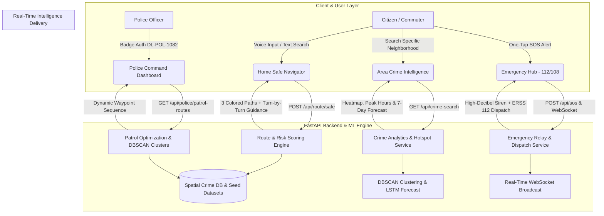

# 🛡️ Rakshak AI — Public Safety & Route Intelligence Platform

[](https://nextjs.org/)
[](https://react.dev/)
[](https://fastapi.tiangolo.com/)
[](https://python.org/)
[](https://opensource.org/licenses/MIT)

> **Real-Time AI-Driven Public Safety Intelligence, 3-Route Dynamic Risk Scoring, Crime Forecasting & Emergency Dispatch Ecosystem.**

---

## 📌 Table of Contents
1. [Overview & Problem Statement](#-overview--problem-statement)
2. [End-to-End System Workflow](#-end-to-end-system-workflow)
3. [Core Feature Modules](#-core-feature-modules)
4. [Machine Learning & Algorithm Architecture](#-machine-learning--algorithm-architecture)
5. [Tech Stack](#-tech-stack)
6. [Local Installation & Setup Guide](#-local-installation--setup-guide)
7. [API Endpoints Reference](#-api-endpoints-reference)
8. [Test Logins & Demo Credentials](#-test-logins--demo-credentials)
9. [Project Directory Structure](#-project-directory-structure)

---

## 📖 Overview & Problem Statement

Standard navigation platforms (such as Google Maps) optimize purely for the **shortest distance** or **fastest travel time**, often directing pedestrians and late-night commuters through dimly lit alleys, high-crime corridors, and isolated transit stretches.

**Rakshak AI** solves this critical public safety challenge by computing a dynamic **Rakshak Safety Score (0–100)** for every road segment and destination. By ingesting verified spatial crime records, street illumination levels, police station proximity, CCTV coverage, and real-time incident telemetry, Rakshak AI recommends:
- 🛡️ **Safest Route** (High illumination, verified police patrol corridors)
- ⚖️ **Balanced Route** (Optimal time-to-safety trade-off)
- ⚡ **Fastest Route** (Quickest path with risk warning alerts)

---

## 🔄 End-to-End System Workflow



### Detailed Workflow Step-by-Step:
1. **User Input & Role Selection**: The user enters the platform (as a Citizen, Healthcare Worker, Police Officer, or Corporate Commuter).
2. **Real-Time Spatial Query**: When origin and destination are set (e.g. *Connaught Place to Saket*), coordinates are forwarded to the FastAPI backend.
3. **Multi-Factor Risk Scoring**: The system queries historical crime records within a 1.5 km buffer, evaluates street lighting factors, police station distances, and time-of-day weights.
4. **Modified Dijkstra Pathfinding**: The routing algorithm generates three distinct trajectories with clear trade-off explanations.
5. **AI Copilot & Voice Guidance**: The user can activate the interactive Voice Agent to receive spoken turn-by-turn navigation checkpoints.
6. **Active Geofencing & Emergency Standby**: While in transit, live geofencing monitors deviation from the safe corridor; any triggered SOS immediately notifies police dispatch over WebSockets and sounds a deterrence siren.

---

## 🚀 Core Feature Modules

### 1. 🧭 Smart 3-Route Navigation Engine
- **Three-Tier Path Comparison**: Compare Safest, Balanced, and Fastest corridors simultaneously.
- **Rakshak Safety Score (0–100)**: Multi-parameter score evaluating ambient illumination, crime rate, and PCR van proximity.
- **Turn-by-Turn Navigation Guidance**: Interactive checkpoint cards with high-contrast directions and audio narration.

### 2. 🔍 Area Crime Intelligence (`/crime-search`)
- **Spatial Heatmaps**: Interactive Leaflet heatmaps visualizing high-density incident zones.
- **DBSCAN Hotspot Detection**: Automatically clusters crime data into categorized risk zones.
- **Peak Hour Windows**: Graphically identifies dangerous time windows (e.g., *20:00–23:00 Night High Alert*).
- **7-Day LSTM Neural Forecast**: Deep learning model projecting weekly crime trajectory.
- **Random Forest Pattern Matrix**: Daily risk probability breakdown across all 7 days.

### 3. 👮 Police Command & Patrol Dashboard (`/police-dashboard`)
- **Secure Badge Login**: Officer credential validation (`DL-POL-1082`).
- **Resource Allocation Optimization**: Strategic distribution of PCR vans, motorcycle squads, and beat officers.
- **Dynamic Patrol Routing**: Computes shortest patrol tours covering all active DBSCAN clusters.
- **Live SOS Dispatch Receiver**: Real-time incoming emergency alerts with one-click dispatch confirmation.

### 4. 🎙️ Rakshak Voice Agent & Navigation
- **Natural Voice Input**: Powered by Speech Recognition & Whisper AI for hands-free queries.
- **Spoken Checkpoint Narration**: High-clarity Text-to-Speech (TTS) guidance for walkers and drivers.
- **English & Hindi Support**: Seamless multi-lingual processing.

### 5. 🧪 What-If Safety Simulator
- **Scenario Stress-Testing**: Simulate how travel safety changes with Departure Hour, Mode (Walking vs Cab vs Metro), Street Lighting, and Weather conditions.

### 6. 🚨 24x7 Emergency Hub & SOS System
- **Unified Emergency Relay**: Instant connectivity with Police ERSS (112) and Medical First Responders (108).
- **High-Decibel Siren**: On-device audible deterrence alarm.
- **Family Geofencing**: Live GPS tracking shareable with trusted emergency contacts.

---

## 🔬 Machine Learning & Algorithm Architecture

1. **Spatial Hotspot Clustering (DBSCAN)**:
   - Evaluates crime coordinate density using Haversine metric ($\epsilon = 0.5\text{ km}$, $\text{min\_samples} = 5$) to detect high-density risk clusters.
2. **Time-Series Crime Forecasting (LSTM)**:
   - Recurrent Neural Network trained on sequential daily incident records to project 7-day future crime volumes with confidence intervals.
3. **Weekly Risk Classifier (Random Forest)**:
   - Predicts high-risk days of the week based on historical day-of-week patterns, holidays, and event indicators.
4. **Modified Dijkstra Safe Routing**:
   - Edge cost function incorporates both physical distance and spatial risk penalty:
   $$\text{Cost}(e) = \text{Distance}(e) \times \left(1 + \lambda \times \text{RiskPenalty}(e)\right)$$

---

## 💻 Tech Stack

- **Frontend**: Next.js 16 (App Router, Turbopack), React 19, TypeScript, Leaflet.js, OpenStreetMap, Modern Vanilla CSS Tokens, Lucide Icons
- **Backend**: Python 3.11+, FastAPI (Async ASGI), Uvicorn, SQLAlchemy Async, Pydantic, Geopy, NetworkX
- **Database**: SQLite (Local Dev) / PostgreSQL + PostGIS (Production)
- **AI & ML**: Scikit-learn, TensorFlow / PyTorch LSTM, NumPy, Pandas

---

## 🛠️ Local Installation & Setup Guide

### 1. Prerequisites
- **Python 3.10+**
- **Node.js 18+ & npm**
- **Git**

---

### 2. Backend Setup (FastAPI)

1. Open a Command Prompt (CMD) / Terminal and navigate to the backend folder:
   ```cmd
   cd C:\Users\ujjaw\OneDrive\Desktop\Rakshak_AI\backend
   ```

2. Activate the Python Virtual Environment:
   - **Windows (CMD)**:
     ```cmd
     venv\Scripts\activate
     ```
   - **Windows (PowerShell)**:
     ```powershell
     .\venv\Scripts\Activate.ps1
     ```
   - **Linux / Mac**:
     ```bash
     source venv/bin/activate
     ```

3. *(Optional - First time)* Install dependencies & seed database:
   ```bash
   pip install -r requirements.txt
   python -m app.seed
   ```

4. Start the backend development server:
   ```bash
   python -m uvicorn app.main:app --host 127.0.0.1 --port 8000 --reload
   ```

   - 🟢 **Backend Live**: `http://127.0.0.1:8000`
   - 📖 **Interactive Swagger Docs**: `http://127.0.0.1:8000/docs`

---

### 3. Frontend Setup (Next.js)

1. Open a second Terminal / CMD window and navigate to the frontend folder:
   ```cmd
   cd C:\Users\ujjaw\OneDrive\Desktop\Rakshak_AI\frontend
   ```

2. Install dependencies *(first time only)*:
   ```bash
   npm install
   ```

3. Start the Next.js frontend dev server:
   ```bash
   npm run dev
   ```

   - 🟢 **Web Application Live**: [http://localhost:3000](http://localhost:3000)

---

## 📡 API Endpoints Reference

| Method | Endpoint | Description |
| :--- | :--- | :--- |
| `GET` | `/api/cities` | Returns supported cities and central geographic coordinates |
| `GET` | `/api/hotspots?city=Delhi` | Returns GeoJSON FeatureCollection of DBSCAN hotspot clusters |
| `GET` | `/api/crime-search?area=Saket` | Area crime breakdown, peak hour distribution, and safety score |
| `GET` | `/api/safety-heatmap?city=Delhi` | Spatial density grid for heatmap overlay |
| `POST` | `/api/route/compare` | Calculates Safest, Balanced, and Fastest 3-route comparison |
| `POST` | `/api/simulator/what-if` | Simulates multi-factor scenario stress-testing impact |
| `POST` | `/api/agent/query` | AI Copilot natural language voice reasoning endpoint |
| `POST` | `/api/sos` | Dispatches emergency SOS alert with GPS coordinates |
| `POST` | `/api/police/login` | Officer authentication (Badge ID + PIN verification) |
| `GET` | `/api/police/dashboard` | Real-time crime telemetry, resource counts, and incident queue |
| `GET` | `/api/police/patrol-routes` | Computes optimal patrol paths through high-risk hotspots |

---

## 🔑 Test Logins & Demo Credentials

- **Citizen / Public Commuter**: One-Click Sign-In via Google OAuth or standard demo session.
- **Police Officer Command Portal**:
  - **Officer Badge ID**: `DL-POL-1082`
  - **Security PIN**: `7721`

---

## 📂 Project Directory Structure

```plaintext
Rakshak_AI/
├── backend/                       # FastAPI Python Backend
│   ├── app/
│   │   ├── routers/              # API Route Controllers (public, police, assistant, simulator)
│   │   ├── ml/                   # Machine Learning Models (DBSCAN, LSTM, Scoring Engine)
│   │   ├── models.py             # SQLAlchemy Database Models
│   │   ├── seed.py               # Dataset Ingestion & Seeding Script
│   │   └── main.py               # FastAPI App Bootstrap
│   ├── venv/                     # Python Virtual Environment
│   ├── requirements.txt          # Python Dependencies
│   └── rakshak.db                # SQLite Spatial Database
│
├── frontend/                      # Next.js 16 Web Application
│   ├── src/
│   │   ├── app/                  # App Router Pages (Home, /crime-search, /police-dashboard)
│   │   ├── components/           # Reusable UI & Widget Components
│   │   ├── context/              # AuthContext, ThemeContext
│   │   ├── lib/                  # API Services & Navigation Clients
│   │   └── styles/               # CSS Design Tokens & Theme Configuration
│   └── package.json
│
└── docs/                          # Architecture, Security, Data & Deployment Documentation
```

---

## 📜 License
This project is licensed under the MIT License — see the [LICENSE](LICENSE) file for details.
