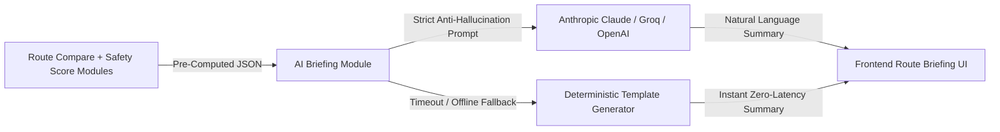

# AI Safety Briefing Module — Rakshak AI

The **AI Safety Briefing Module** transforms structured route risk and safety metrics (pre-computed by the Route Compare and Safety Score engines) into clear, reassuring, natural-language briefings for commuters.

---

## 🛡️ Critical Anti-Hallucination Philosophy

> **CRITICAL RULE**: The LLM **NEVER** computes route geometries, risk indices, crime statistics, or safety scores itself.
> It exclusively receives pre-calculated, deterministic JSON numbers from backend analytics modules and translates them into actionable English summaries.



### Key Architectural Tenets:
1. **Zero-Hallucination System Prompt**: Explicitly commands the model:
   *"Only use the numbers provided. Do not invent crime details, street names, or statistics not present in the input JSON."*
2. **Dedicated Prompt Templates**: Prompts reside in isolated template modules ([`prompt_templates.py`](file:///c:/Users/ujjaw/OneDrive/Desktop/Rakshak_AI/backend/app/ai_briefing/prompt_templates.py)) rather than inline strings in router handlers.
3. **Deterministic Fallback Engine**: If the LLM call times out (>6s) or encounters an API failure, the module instantly invokes a rule-based template builder to ensure zero blocking or degraded user experience.
4. **Stateless / No Caching Overhead**: Prompts are dynamically evaluated on demand per route query.

---

## 📡 API Reference

### Generate AI Route Safety Briefing
```http
POST /api/ai/briefing
Content-Type: application/json

{
  "distance": 14.2,
  "duration": 38,
  "safetyScore": 58,
  "hotspots": 2,
  "highRiskSegments": 1,
  "alternative": {
    "type": "safest",
    "duration": 44,
    "safetyScore": 94
  }
}
```

#### Sample Response:
```json
{
  "briefing": "Your journey is 14.2 km and approximately 38 minutes with a Safety Score of 58/100. The selected route contains 2 historical crime hotspots and 1 high-risk segment. The Safest Route adds approximately 6 minute(s) but increases Safety Score to 94/100 and avoids high-risk segments.\n\nRecommendation: Safest Route",
  "source": "anthropic_claude",
  "model": "claude-3-5-sonnet"
}
```

---

## 🧪 Deterministic Fallback Logic

When the LLM is offline or disabled, [`fallback_generator.py`](file:///c:/Users/ujjaw/OneDrive/Desktop/Rakshak_AI/backend/app/ai_briefing/fallback_generator.py) produces rule-governed trade-off summaries in <1ms:

$$\Delta t = t_{\text{alt}} - t_{\text{curr}}$$
$$\Delta S = S_{\text{alt}} - S_{\text{curr}}$$

- If $\Delta S > 10$ or alternative is `safest`: Highlights risk reduction and recommends the safer corridor.
- Reassures travelers with clear route comparisons without hallucinating unknown landmarks.
