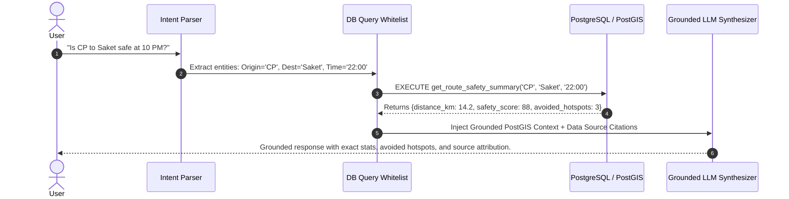

# AI & Machine Learning Architecture Specification
**Crime Alert Map (Rakshak AI)**

---

## 1. Modular AI / ML Service Architecture

```
ai/
├── hotspot_detection/
│   ├── dbscan_clusterer.py        # Spatial DBSCAN with Haversine metric
│   ├── hdbscan_clusterer.py       # Density-adaptive hierarchical clustering
│   └── kde_estimator.py           # Kernel Density Estimation with Gaussian kernel
├── risk_scoring/
│   ├── risk_formula_engine.py     # 0-100 Multi-Factor Explainable Risk Evaluator
│   ├── temporal_modifiers.py      # Day/Night and Day-of-Week adjustments
│   └── context_modifiers.py       # Lighting, PCR proximity, and road type weights
├── crime_prediction/
│   ├── segment_risk_classifier.py # Gradient Boosted Tree (XGBoost / LightGBM)
│   ├── feature_pipeline.py        # Spatial lag features, historical density
│   └── calibration.py             # Platt scaling & isotonic probability calibration
├── route_risk/
│   ├── graph_weight_evaluator.py  # Dijkstra/A* multi-factor edge penalty assigner
│   └── tradeoff_analyzer.py       # Pareto front analysis (Safety vs. ETA)
├── rag_supervisor/
│   ├── query_parser.py            # Spatial entity extraction (Named Entity Recognition)
│   ├── retrieval_engine.py        # PostGIS SQL generator with parameter guardrails
│   └── grounded_generator.py      # LLM response synthesizer citing source registry
└── evaluation/
    ├── spatial_cross_validation.py # Spatial block cross-validation (prevent spatial leakage)
    └── metrics.py                 # Silhouette, Davies-Bouldin, ROC-AUC, Brier Score
```

---

## 2. Hotspot Detection Engine: Spatial DBSCAN & KDE

### 2.1 Why DBSCAN for Spatial Crime Clustering?
1. **Arbitrary Geometric Shapes**: Crime corridors form linear and irregular clusters along highway stretches, which k-Means ($k$-spheres) fundamentally fails to model.
2. **Noise Rejection**: Solitary isolated incidents are classified as noise ($-1$) rather than forcing them into false danger zones.
3. **No Prior $k$ Assumption**: Automatically identifies the natural number of spatial clusters across variable urban and rural densities.

### 2.2 Mathematical Formulation
Given a set of geo-located crime incident coordinates $P = \{(lat_i, lon_i)\}_{i=1}^N$:

1. **Distance Metric (Great-Circle Haversine)**:
   $$d(p_i, p_j) = 2 R \arcsin \left( \sqrt{\sin^2\left(\frac{\Delta \phi}{2}\right) + \cos \phi_i \cos \phi_j \sin^2\left(\frac{\Delta \lambda}{2}\right)} \right)$$
   Where $R = 6,371\text{ km}$, $\phi = \text{latitude in radians}$, $\lambda = \text{longitude in radians}$.

2. **Core Point Condition**:
   A point $p \in P$ is a core point if:
   $$|N_\epsilon(p)| \ge \text{MinPts}, \quad \text{where } N_\epsilon(p) = \{q \in P \mid d(p, q) \le \epsilon\}$$
   - Default Metropolitan Parameters: $\epsilon = 450\text{ meters}$, $\text{MinPts} = 6\text{ incidents}$.
   - Default Highway/Rural Parameters: $\epsilon = 1,200\text{ meters}$, $\text{MinPts} = 4\text{ incidents}$.

3. **Cluster Hull Generation**:
   For each discovered cluster $C_k$, compute the $\alpha$-Shape (Concave Hull) or Convex Hull with a buffer of $75\text{m}$ to output the spatial polygon stored in `hotspots` table.

---

## 3. Explainable 0–100 Crime Alert Risk Score

The platform strictly avoids "black-box" mystery scores. Every risk score is calculated via an open, audited multi-factor formula with full parameter breakdown:

### 3.1 Mathematical Formulation for Road Segment $e$

$$\text{RiskScore}(e) = \min\left(100, \max\left(0, S_{\text{base}}(e) + \Delta_{\text{time}} + \Delta_{\text{lighting}} - B_{\text{emergency}}\right)\right)$$

Where:
1. **Base Spatial Risk Component** ($S_{\text{base}}$):
   $$S_{\text{base}}(e) = w_c \cdot \widetilde{C}_{\text{density}}(e) + w_a \cdot \widetilde{A}_{\text{density}}(e) + w_h \cdot H_{\text{overlap}}(e)$$
   - $\widetilde{C}_{\text{density}}(e)$: Normalized historical crime density within $300\text{m}$ buffer ($0 - 45$).
   - $\widetilde{A}_{\text{density}}(e)$: Normalized accident blackspot frequency ($0 - 25$).
   - $H_{\text{overlap}}(e)$: Binary or weighted intersection with active DBSCAN Hotspot ($0\text{ or }20$).
   - Standard Weights: $w_c = 0.45, w_a = 0.25, w_h = 0.30$.

2. **Temporal & Lighting Modifier** ($\Delta_{\text{time}} + \Delta_{\text{lighting}}$):
   - Day Mode (06:00 – 19:59): $\Delta_{\text{time}} = 0$.
   - Night Mode (20:00 – 05:59): $\Delta_{\text{time}} = +15.0 \cdot (1 - \text{FootfallProxy})$.
   - Unlit Road Modifier: $\Delta_{\text{lighting}} = +18.0$ (if `is_lit = FALSE` or streetlight illumination $< 35\%$).

3. **Emergency Proximity Bonus** ($B_{\text{emergency}}$):
   $$B_{\text{emergency}} = \min\left(15.0, \frac{15.0}{1.0 + 0.001 \cdot d_{\text{police}}(e)}\right)$$
   - Direct deduction up to $-15.0$ points when within $500\text{m}$ of an active 24x7 Police Station or PCR booth.

### 3.2 Human-Readable Explanation Generation
```json
{
  "segment_id": 48192,
  "overall_risk_score": 74.5,
  "risk_level": "HIGH",
  "confidence": "HIGH (Verified Spatial Cluster)",
  "explanation_breakdown": {
    "historical_crime_density": "+32.0 (14 snatching/robbery incidents within 300m buffer)",
    "accident_blackspot_factor": "+12.5 (Designated MoRTH high-frequency collision zone)",
    "hotspot_proximity": "+20.0 (Inside DBSCAN Cluster #12)",
    "lighting_penalty": "+15.0 (Defective street lighting, 28% illumination)",
    "emergency_bonus": "-5.0 (Police station located 1.4 km away)"
  }
}
```

---

## 4. Grounded RAG AI Assistant Architecture

To guarantee that the AI Assistant never hallucinates statistics or invents fake incidents:


