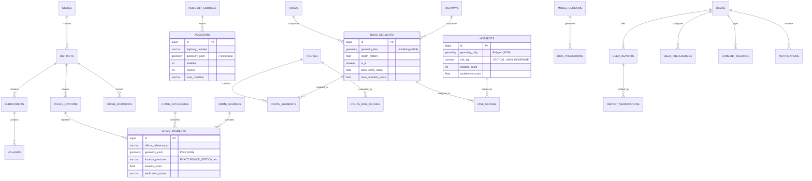

# Database Architecture & PostGIS Schema Specification
**Crime Alert Map (Rakshak AI)**
*Engine: PostgreSQL 16.x with PostGIS 3.4 Spatial Extensions*

---

## 1. Database Entity-Relationship (ER) Diagram



---

## 2. Core Enums & Spatial Types

```sql
-- Enable PostGIS extensions
CREATE EXTENSION IF NOT EXISTS postgis;
CREATE EXTENSION IF NOT EXISTS postgis_topology;
CREATE EXTENSION IF NOT EXISTS btree_gist;

-- Location precision hierarchy enum
CREATE TYPE location_precision_enum AS ENUM (
    'EXACT',
    'ROAD_SEGMENT',
    'POLICE_STATION',
    'VILLAGE',
    'SUBDISTRICT',
    'DISTRICT',
    'STATE',
    'UNKNOWN'
);

-- Verification status
CREATE TYPE verification_status_enum AS ENUM (
    'OFFICIAL_GOVERNMENT',
    'VERIFIED_COMMISSIONERATE',
    'COMMUNITY_VERIFIED',
    'UNVERIFIED',
    'REJECTED_SPAM',
    'NEEDS_REVIEW'
);

-- Data source reliability tier
CREATE TYPE source_tier_enum AS ENUM (
    'TIER_A_OFFICIAL',
    'TIER_B_GEOSPATIAL',
    'TIER_C_ACADEMIC',
    'TIER_D_SECONDARY',
    'TIER_E_USER_REPORT'
);

-- Risk level classification
CREATE TYPE risk_level_enum AS ENUM (
    'LOW',
    'MODERATE',
    'ELEVATED',
    'HIGH',
    'CRITICAL_DANGER'
);
```

---

## 3. Complete DDL Schema Definitions

### 3.1 Administrative Boundaries & Demographics

```sql
CREATE TABLE states (
    id SERIAL PRIMARY KEY,
    state_code VARCHAR(10) UNIQUE NOT NULL,
    state_name VARCHAR(100) NOT NULL,
    capital VARCHAR(100),
    area_sq_km NUMERIC(12, 2),
    population_census_2011 BIGINT,
    geometry GEOMETRY(MultiPolygon, 4326) NOT NULL,
    created_at TIMESTAMPTZ DEFAULT NOW(),
    updated_at TIMESTAMPTZ DEFAULT NOW()
);
CREATE INDEX idx_states_geom ON states USING GIST (geometry);

CREATE TABLE districts (
    id SERIAL PRIMARY KEY,
    state_id INT NOT NULL REFERENCES states(id) ON DELETE CASCADE,
    district_code VARCHAR(20) UNIQUE NOT NULL,
    district_name VARCHAR(150) NOT NULL,
    headquarters VARCHAR(150),
    geometry GEOMETRY(MultiPolygon, 4326) NOT NULL,
    data_coverage_tier VARCHAR(20) DEFAULT 'GOOD', -- FULL, GOOD, PARTIAL, LIMITED, NONE
    created_at TIMESTAMPTZ DEFAULT NOW()
);
CREATE INDEX idx_districts_geom ON districts USING GIST (geometry);
CREATE INDEX idx_districts_state ON districts(state_id);

CREATE TABLE subdistricts (
    id SERIAL PRIMARY KEY,
    district_id INT NOT NULL REFERENCES districts(id) ON DELETE CASCADE,
    subdistrict_name VARCHAR(150) NOT NULL,
    geometry GEOMETRY(MultiPolygon, 4326) NOT NULL,
    created_at TIMESTAMPTZ DEFAULT NOW()
);
CREATE INDEX idx_subdistricts_geom ON subdistricts USING GIST (geometry);

CREATE TABLE villages (
    id BIGSERIAL PRIMARY KEY,
    subdistrict_id INT NOT NULL REFERENCES subdistricts(id) ON DELETE CASCADE,
    village_name VARCHAR(200) NOT NULL,
    census_code VARCHAR(50),
    centroid GEOMETRY(Point, 4326),
    geometry GEOMETRY(MultiPolygon, 4326),
    created_at TIMESTAMPTZ DEFAULT NOW()
);
CREATE INDEX idx_villages_geom ON villages USING GIST (geometry);
CREATE INDEX idx_villages_centroid ON villages USING GIST (centroid);
```

---

### 3.2 Road Network & Segment Graph

```sql
CREATE TABLE highways (
    id SERIAL PRIMARY KEY,
    highway_number VARCHAR(50) NOT NULL, -- e.g., 'NH-44', 'SH-1'
    highway_type VARCHAR(50) NOT NULL,   -- 'NATIONAL', 'STATE', 'EXPRESSWAY'
    total_length_km NUMERIC(10, 2),
    geometry GEOMETRY(MultiLineString, 4326) NOT NULL,
    created_at TIMESTAMPTZ DEFAULT NOW()
);
CREATE INDEX idx_highways_geom ON highways USING GIST (geometry);

CREATE TABLE road_segments (
    id BIGSERIAL PRIMARY KEY,
    osm_id BIGINT UNIQUE,
    road_name VARCHAR(255),
    highway_type VARCHAR(50),            -- 'motorway', 'primary', 'secondary', 'residential', etc.
    district_id INT REFERENCES districts(id),
    length_meters NUMERIC(10, 2) NOT NULL,
    is_oneway BOOLEAN DEFAULT FALSE,
    is_lit BOOLEAN DEFAULT TRUE,
    surface_type VARCHAR(50) DEFAULT 'asphalt',
    maxspeed_kmh INT DEFAULT 40,
    geometry GEOMETRY(LineString, 4326) NOT NULL,
    
    -- Derived Risk Baseline Attributes
    historical_crime_density NUMERIC(8, 4) DEFAULT 0.0,
    historical_accident_density NUMERIC(8, 4) DEFAULT 0.0,
    current_risk_score NUMERIC(5, 2) DEFAULT 20.0, -- 0 to 100
    risk_level risk_level_enum DEFAULT 'LOW',
    last_risk_calculated_at TIMESTAMPTZ DEFAULT NOW(),
    
    created_at TIMESTAMPTZ DEFAULT NOW()
);
CREATE INDEX idx_road_segments_geom ON road_segments USING GIST (geometry);
CREATE INDEX idx_road_segments_risk ON road_segments(current_risk_score);
```

---

### 3.3 Crime Data Architecture (Incident Points vs. District Aggregates)

```sql
CREATE TABLE crime_sources (
    id SERIAL PRIMARY KEY,
    source_name VARCHAR(150) NOT NULL,
    organization VARCHAR(200) NOT NULL,
    tier source_tier_enum NOT NULL,
    official_url TEXT,
    license VARCHAR(100) DEFAULT 'GODL-India',
    update_frequency VARCHAR(50),
    is_active BOOLEAN DEFAULT TRUE,
    created_at TIMESTAMPTZ DEFAULT NOW()
);

CREATE TABLE crime_categories (
    id SERIAL PRIMARY KEY,
    category_code VARCHAR(50) UNIQUE NOT NULL, -- 'IPC_VIOLENT', 'CRIMES_AGAINST_WOMEN', etc.
    category_name VARCHAR(150) NOT NULL,
    severity_weight NUMERIC(4, 2) NOT NULL DEFAULT 1.0, -- 1.0 to 10.0 multiplier
    description TEXT
);

-- Incident-Level Records (Only where official or verified point/segment locations exist)
CREATE TABLE crime_incidents (
    id BIGSERIAL PRIMARY KEY,
    source_id INT NOT NULL REFERENCES crime_sources(id),
    official_reference_id VARCHAR(100),
    category_id INT NOT NULL REFERENCES crime_categories(id),
    subcategory VARCHAR(150),
    
    incident_date DATE NOT NULL,
    incident_time TIME,
    year INT NOT NULL,
    month INT NOT NULL,
    
    state_id INT REFERENCES states(id),
    district_id INT REFERENCES districts(id),
    police_station_id INT,
    nearest_road_segment_id BIGINT REFERENCES road_segments(id),
    
    latitude NUMERIC(10, 7),
    longitude NUMERIC(10, 7),
    geometry GEOMETRY(Point, 4326),
    location_precision location_precision_enum NOT NULL,
    location_method VARCHAR(100), -- 'GPS_LOG', 'POLICE_STATION_CENTROID', 'OSM_MATCH'
    
    severity_score NUMERIC(5, 2) DEFAULT 5.0,
    verification_status verification_status_enum DEFAULT 'OFFICIAL_GOVERNMENT',
    data_confidence VARCHAR(50) DEFAULT 'HIGH',
    provenance_url TEXT,
    
    created_at TIMESTAMPTZ DEFAULT NOW(),
    updated_at TIMESTAMPTZ DEFAULT NOW()
);
CREATE INDEX idx_crime_incidents_geom ON crime_incidents USING GIST (geometry);
CREATE INDEX idx_crime_incidents_date ON crime_incidents(incident_date);
CREATE INDEX idx_crime_incidents_district ON crime_incidents(district_id);
CREATE INDEX idx_crime_incidents_precision ON crime_incidents(location_precision);

-- Aggregated District-Level Statistics (NCRB Crime in India Datasets)
CREATE TABLE crime_statistics (
    id BIGSERIAL PRIMARY KEY,
    source_id INT NOT NULL REFERENCES crime_sources(id),
    district_id INT NOT NULL REFERENCES districts(id),
    year INT NOT NULL,
    crime_category VARCHAR(150) NOT NULL,
    reported_cases INT NOT NULL DEFAULT 0,
    chargesheeted_cases INT DEFAULT 0,
    convicted_cases INT DEFAULT 0,
    rate_per_lakh_population NUMERIC(8, 2),
    created_at TIMESTAMPTZ DEFAULT NOW(),
    UNIQUE(district_id, year, crime_category)
);
CREATE INDEX idx_crime_stats_district_year ON crime_statistics(district_id, year);
```

---

### 3.4 Road Accident Layer (Physical Separation from Crimes)

```sql
CREATE TABLE accident_sources (
    id SERIAL PRIMARY KEY,
    source_name VARCHAR(150) NOT NULL,
    organization VARCHAR(200) NOT NULL,
    official_url TEXT,
    tier source_tier_enum DEFAULT 'TIER_A_OFFICIAL'
);

CREATE TABLE accidents (
    id BIGSERIAL PRIMARY KEY,
    source_id INT NOT NULL REFERENCES accident_sources(id),
    official_case_no VARCHAR(100),
    accident_date DATE NOT NULL,
    accident_time TIME,
    year INT NOT NULL,
    
    district_id INT REFERENCES districts(id),
    highway_number VARCHAR(50),
    road_name VARCHAR(255),
    nearest_road_segment_id BIGINT REFERENCES road_segments(id),
    
    latitude NUMERIC(10, 7),
    longitude NUMERIC(10, 7),
    geometry GEOMETRY(Point, 4326),
    location_precision location_precision_enum NOT NULL,
    
    severity VARCHAR(50) DEFAULT 'GRIEVOUS', -- 'FATAL', 'GRIEVOUS', 'MINOR_INJURY'
    fatalities INT DEFAULT 0,
    injuries INT DEFAULT 0,
    vehicles_involved INT DEFAULT 1,
    weather_condition VARCHAR(100),
    road_condition VARCHAR(100),
    
    created_at TIMESTAMPTZ DEFAULT NOW()
);
CREATE INDEX idx_accidents_geom ON accidents USING GIST (geometry);
CREATE INDEX idx_accidents_segment ON accidents(nearest_road_segment_id);
```

---

### 3.5 AI Hotspots & Explanatory Risk Scores

```sql
CREATE TABLE hotspots (
    id BIGSERIAL PRIMARY KEY,
    district_id INT REFERENCES districts(id),
    algorithm VARCHAR(50) DEFAULT 'DBSCAN', -- 'DBSCAN', 'HDBSCAN', 'KDE_GRID'
    cluster_label INT NOT NULL,
    
    geometry GEOMETRY(Polygon, 4326) NOT NULL,
    centroid GEOMETRY(Point, 4326) NOT NULL,
    radius_meters NUMERIC(10, 2),
    
    crime_count INT NOT NULL,
    dominant_crime_category VARCHAR(100),
    average_severity NUMERIC(5, 2),
    risk_tag risk_level_enum NOT NULL,
    
    time_window_start TIMESTAMPTZ,
    time_window_end TIMESTAMPTZ,
    confidence_score NUMERIC(4, 2) DEFAULT 0.85, -- 0.00 to 1.00
    model_version VARCHAR(50) NOT NULL,
    
    created_at TIMESTAMPTZ DEFAULT NOW()
);
CREATE INDEX idx_hotspots_geom ON hotspots USING GIST (geometry);
CREATE INDEX idx_hotspots_risk_tag ON hotspots(risk_tag);

CREATE TABLE risk_scores (
    id BIGSERIAL PRIMARY KEY,
    road_segment_id BIGINT NOT NULL REFERENCES road_segments(id) ON DELETE CASCADE,
    
    overall_score NUMERIC(5, 2) NOT NULL, -- 0.00 to 100.00
    crime_risk_component NUMERIC(5, 2) NOT NULL,
    accident_risk_component NUMERIC(5, 2) NOT NULL,
    lighting_penalty_component NUMERIC(5, 2) NOT NULL,
    emergency_proximity_bonus NUMERIC(5, 2) NOT NULL,
    
    day_score NUMERIC(5, 2) NOT NULL,
    night_score NUMERIC(5, 2) NOT NULL,
    women_safety_score NUMERIC(5, 2) NOT NULL,
    
    risk_level risk_level_enum NOT NULL,
    explanation_text TEXT NOT NULL,
    confidence_tier VARCHAR(50) DEFAULT 'HIGH',
    
    calculated_at TIMESTAMPTZ DEFAULT NOW()
);
CREATE INDEX idx_risk_scores_segment ON risk_scores(road_segment_id);
```

---

### 3.6 Emergency Services & POI Infrastructure

```sql
CREATE TABLE police_stations (
    id SERIAL PRIMARY KEY,
    district_id INT REFERENCES districts(id),
    station_name VARCHAR(200) NOT NULL,
    jurisdiction_polygon GEOMETRY(MultiPolygon, 4326),
    location_point GEOMETRY(Point, 4326) NOT NULL,
    phone_number VARCHAR(50),
    sho_contact VARCHAR(50),
    is_women_helpdesk_present BOOLEAN DEFAULT TRUE,
    created_at TIMESTAMPTZ DEFAULT NOW()
);
CREATE INDEX idx_police_stations_geom ON police_stations USING GIST (location_point);

CREATE TABLE hospitals (
    id SERIAL PRIMARY KEY,
    district_id INT REFERENCES districts(id),
    hospital_name VARCHAR(255) NOT NULL,
    facility_type VARCHAR(100) DEFAULT 'GOVERNMENT_HOSPITAL', -- 'TRAUMA_CENTER', 'DISTRICT_HOSPITAL', 'PRIVATE'
    has_emergency_ward BOOLEAN DEFAULT TRUE,
    has_24x7_ambulance BOOLEAN DEFAULT TRUE,
    location_point GEOMETRY(Point, 4326) NOT NULL,
    phone_number VARCHAR(50),
    created_at TIMESTAMPTZ DEFAULT NOW()
);
CREATE INDEX idx_hospitals_geom ON hospitals USING GIST (location_point);

CREATE TABLE fire_stations (
    id SERIAL PRIMARY KEY,
    district_id INT REFERENCES districts(id),
    station_name VARCHAR(200) NOT NULL,
    location_point GEOMETRY(Point, 4326) NOT NULL,
    emergency_phone VARCHAR(50) DEFAULT '101',
    created_at TIMESTAMPTZ DEFAULT NOW()
);
CREATE INDEX idx_fire_stations_geom ON fire_stations USING GIST (location_point);
```

---

### 3.7 Crowdsourced User Reports & Moderation Workflow

```sql
CREATE TABLE user_reports (
    id BIGSERIAL PRIMARY KEY,
    user_id BIGINT NOT NULL,
    category VARCHAR(100) NOT NULL, -- 'DARK_UNLIT_ROAD', 'HARASSMENT', 'SNATCHING', 'SUSPICIOUS_GATHERING'
    description TEXT,
    
    latitude NUMERIC(10, 7) NOT NULL,
    longitude NUMERIC(10, 7) NOT NULL,
    geometry GEOMETRY(Point, 4326) NOT NULL,
    reported_time TIMESTAMPTZ NOT NULL DEFAULT NOW(),
    
    media_url TEXT,
    status verification_status_enum DEFAULT 'UNVERIFIED',
    spam_score NUMERIC(4, 2) DEFAULT 0.05,
    upvotes INT DEFAULT 1,
    downvotes INT DEFAULT 0,
    
    moderator_notes TEXT,
    moderated_by BIGINT,
    moderated_at TIMESTAMPTZ,
    
    created_at TIMESTAMPTZ DEFAULT NOW()
);
CREATE INDEX idx_user_reports_geom ON user_reports USING GIST (geometry);
CREATE INDEX idx_user_reports_status ON user_reports(status);
```
