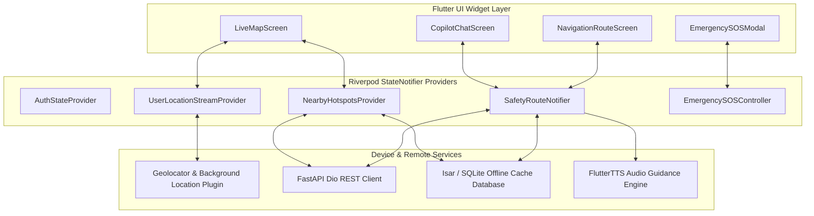
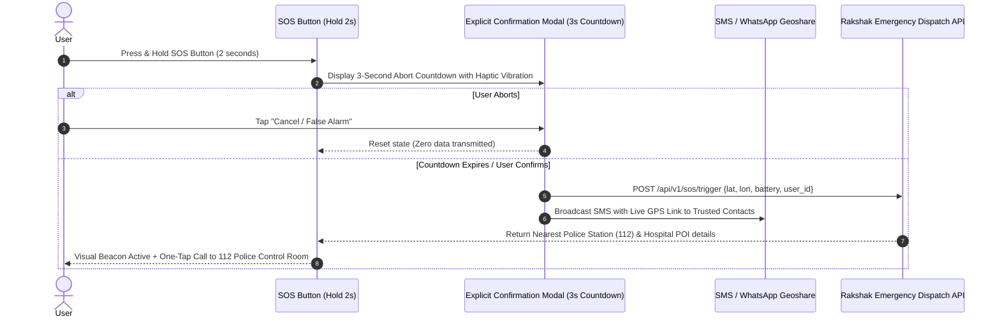

# Mobile Application Architecture Specification
**Crime Alert Map (Rakshak AI) — Android & iOS Client**
*Framework: Flutter 3.x (Dart 3.x) with Cross-Platform Native Compilation*

---

## 1. Mobile Architectural Blueprint

```
mobile/
├── lib/
│   ├── main.dart                      # Application Entry Point & ProviderScope
│   ├── core/
│   │   ├── config/                    # API Endpoints, Environment Configuration
│   │   ├── constants/                 # UI Colors, Themes, Typography, Spatial Bounds
│   │   ├── errors/                    # AppFailure, NetworkException, LocationException
│   │   ├── network/                   # Dio Client with JWT Interceptors & Retry Logic
│   │   └── utils/                     # Formatters, Distance Math, Geolocation Helpers
│   ├── features/
│   │   ├── auth/                      # Login, Registration, OTP, Field Selector
│   │   ├── map/                       # Live MapLibre / Google Maps Layer Controller
│   │   ├── navigation/                # Route Planner, Turn-by-Turn GPS Tracker
│   │   ├── safety_advisor/            # Risk Score Card, Hotspot Alert Banners
│   │   ├── emergency_sos/             # One-Touch SOS, Geoshare, 112 Dispatch
│   │   ├── incident_report/           # Crowdsourced Report Form, Camera/GPS Picker
│   │   ├── ai_copilot/                # Supervisor Agent Voice & Text Chat
│   │   ├── settings/                  # Language (Hindi/English), Permissions, Privacy
│   │   └── data_provenance/           # Data Source Inspector & Coverage Matrix
│   └── shared/
│       ├── widgets/                   # Glassmorphic Cards, Badges, Buttons, Sliders
│       └── services/                  # Background Geofencing, SQLite Offline Cache
```

---

## 2. State Management & Data Flow Architecture

The Flutter mobile application leverages **Riverpod 2.x** with declarative state machines:



---

## 3. Emergency / SOS Flow (Guarded Explicit Confirmation)



---

## 4. Offline Map & Route Resilience

To maintain safety functionality in remote highway dead-zones:
1. **Recent Routes Caching**: Actively calculated safe routes are serialized to encrypted local SQLite/Isar storage.
2. **Offline POI Boundary**: Nearest Police Stations and Hospitals within a $15\text{ km}$ radius are cached upon route departure.
3. **Transparent Indicator**: When network connectivity is lost, the app clearly displays:
   `⚠️ OFFLINE MODE — Displaying Cached Safety Data from 2026-09-11 14:30. GPS Navigation Active.`
