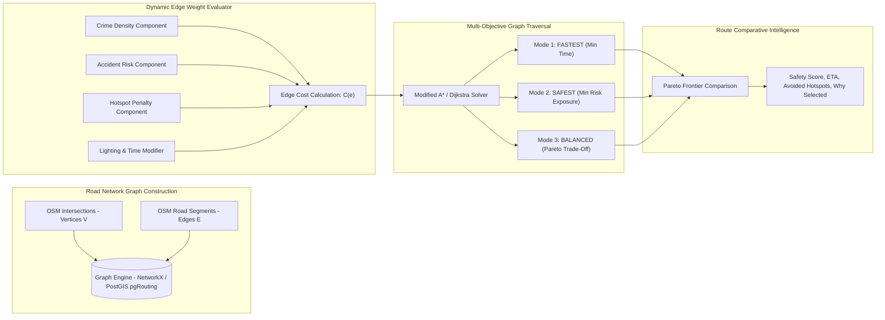

# Safety-Aware Routing Architecture & Algorithms
**Crime Alert Map (Rakshak AI)**

---

## 1. Safety-Aware Routing Algorithm Specification

Standard navigation routing engines operate on a single objective: minimizing travel time ($f(t) = \sum t_e$). In contrast, **Crime Alert Map** models the road network as a directed weighted multi-attribute graph $G = (V, E, W)$, where every edge $e \in E$ carries both physical travel metrics and safety exposure costs.

---

## 2. Mathematical Multi-Objective Cost Function

For an edge $e = (u, v) \in E$, the traversal cost $C(e)$ is evaluated as:

$$C(e) = \alpha \cdot D(e) + \beta \cdot T(e) + \gamma \cdot R_{\text{crime}}(e) + \delta \cdot R_{\text{accident}}(e) + \epsilon \cdot P_{\text{hotspot}}(e) + \zeta \cdot (1 - L(e))$$

Where:
- $D(e)$: Physical length of edge in kilometers.
- $T(e)$: Estimated traversal duration in minutes based on road classification speed limits.
- $R_{\text{crime}}(e)$: Historical and verified crime risk density for edge $e$ ($0.0 - 100.0$).
- $R_{\text{accident}}(e)$: Accident blackspot severity score ($0.0 - 100.0$).
- $P_{\text{hotspot}}(e)$: Hotspot intersection penalty ($+50.0$ if edge traverses a `CRITICAL_DANGER` DBSCAN cluster).
- $L(e)$: Normalized illumination factor ($1.0$ for excellent LED lighting, $0.2$ for unlit).

---

## 3. Configurable Routing Modes & Weight Configurations

| Parameter Weight | Fastest Mode | Safest Mode (Recommended) | Balanced Mode | Night Safety Mode | Women Safety Mode |
| :--- | :--- | :--- | :--- | :--- | :--- |
| **Distance Weight ($\alpha$)** | `0.30` | `0.10` | `0.20` | `0.10` | `0.08` |
| **Time Weight ($\beta$)** | **`0.70`** | `0.20` | `0.40` | `0.15` | `0.12` |
| **Crime Risk Weight ($\gamma$)** | `0.00` | **`0.35`** | `0.20` | **`0.35`** | **`0.40`** |
| **Accident Risk Weight ($\delta$)** | `0.00` | `0.15` | `0.10` | `0.15` | `0.10` |
| **Hotspot Penalty ($\epsilon$)** | `0.00` | **`0.20`** | `0.10` | **`0.25`** | **`0.30`** |
| **Lighting Sensitivity ($\zeta$)** | `0.00` | `0.10` | `0.05` | **`0.30`** | **`0.30`** |

---

## 4. Segment-by-Segment Risk Aggregation & Justification

Unlike naive approaches that calculate the simple arithmetic mean of district risk, the route engine aggregates risk continuously over all discrete constituent road segments:

$$\text{RouteSafetyScore} = 100 - \frac{\sum_{e \in \text{Route}} \text{SegmentRisk}(e) \cdot \text{Length}(e)}{\sum_{e \in \text{Route}} \text{Length}(e)}$$

### Automated Trade-Off Explanation Generator
The system automatically generates comparative metrics showing the user why the Safest route is superior:
- **Baseline (Fastest)**: $12.4\text{ km} \cdot 24\text{ mins} \cdot \text{Safety: } 54/100$ *(Exposes traveler to 2 dark unlit alleys and 1 active snatching hotspot)*.
- **Recommended (Safest)**: $14.2\text{ km} \cdot 27\text{ mins} \cdot \text{Safety: } 88/100$ *(+3 mins ETA detour avoids 100% of high-risk hotspots and keeps traveler on illuminated CCTV monitored arterial corridor)*.
