# System Architecture & Component Blueprint
**Crime Alert Map (Rakshak AI)**

---

## 1. Complete System Architecture Diagram

```mermaid
flowchart TB
    subgraph ExternalSources ["External Authoritative Data Sources"]
        S1["Tier A: NCRB Crime In India (GODL)"]
        S2["Tier A: MoRTH Road Accident Stats"]
        S3["Tier A: OGD Platform (data.gov.in)"]
        S4["Tier A: State Police Portals / Gazettes"]
        S5["Tier B: OpenStreetMap & Overpass API"]
        S6["Tier B: Survey of India Boundaries"]
        S7["Tier E: Citizen Incident Submissions"]
    end

    subgraph IngestionPipeline ["Data Ingestion & Normalization Engine"]
        ING_CTRL["Ingestion Orchestrator (Celery/Cron)"]
        VAL["Schema Validation & Bounds Check"]
        DEDUP["Deduplication & Canonical ID Matcher"]
        PRECISION["Location Precision Tagger (EXACT->DISTRICT)"]
        PROVENANCE["Data Provenance & Audit Logger"]
        
        S1 & S2 & S3 & S4 & S5 & S6 --> ING_CTRL
        S7 -.->|Moderated Queue| ING_CTRL
        ING_CTRL --> VAL --> DEDUP --> PRECISION --> PROVENANCE
    end

    subgraph DataLayer ["Geospatial Storage & Indexing (PostgreSQL 16 + PostGIS 3.4)"]
        PROVENANCE --> POSTGIS[(PostgreSQL 16 + PostGIS 3.4 DB)]
        
        subgraph CoreTables ["Core PostGIS Tables & Views"]
            T_CRIME["crime_incidents (Points/Precision)"]
            T_STATS["crime_statistics (District Aggregates)"]
            T_ACC["accidents (Highway/Corridor Records)"]
            T_ROADS["road_network & road_segments (LineStrings)"]
            T_POI["emergency_services (Police, Hospitals, Fire)"]
            T_ADMIN["states, districts, subdistricts (MultiPolygons)"]
            T_HOTSPOTS["hotspots (DBSCAN Generated Polygons)"]
            T_AUDIT["audit_logs & data_quality_logs"]
        end
        POSTGIS --- CoreTables
    end

    subgraph AI_ML_Engine ["AI / ML & Spatial Intelligence Services"]
        POSTGIS --> DBSCAN_ENG["DBSCAN & HDBSCAN Hotspot Clustering"]
        POSTGIS --> RISK_ENG["0-100 Multi-Factor Risk Scoring Engine"]
        POSTGIS --> PREDICT_ENG["Gradient Boosted Segment Risk Classifier"]
        POSTGIS --> ROUTING_ENG["Multi-Objective Dijkstra/A* Safe Route Engine"]
        
        DBSCAN_ENG --> T_HOTSPOTS
    end

    subgraph APIServices ["Application Backend & Gateway (FastAPI Async)"]
        AUTH_SVC["JWT Auth & Role-Based Access Control"]
        MAP_SVC["Spatial Tiling & Query Endpoints (/api/v1/crimes, /hotspots)"]
        ROUTE_SVC["Safe Route Comparison (/api/v1/routes/analyze)"]
        POI_SVC["Emergency POI Discovery (/api/v1/emergency-services)"]
        REPORT_SVC["Incident Reporting & Moderation (/api/v1/reports)"]
        RAG_SVC["Grounded AI Copilot & Knowledge Retrieval"]
        CACHE_SVC["Redis 7 (Query & Tile Cache)"]

        AI_ML_Engine --> MAP_SVC & ROUTE_SVC
        POSTGIS --> POI_SVC & REPORT_SVC
        CACHE_SVC <--> MAP_SVC & ROUTE_SVC
    end

    subgraph Clients ["Unified Cross-Platform Client Applications"]
        WEB_APP["Next.js 16 / TypeScript Responsive Web App"]
        MOBILE_ANDROID["Flutter Android Application (APK/Bundle)"]
        MOBILE_IOS["Flutter iOS Application (IPA)"]
        ADMIN_PORTAL["Admin Data Governance & Coverage Portal"]

        APIServices <-->|HTTPS / REST / WebSockets| WEB_APP
        APIServices <-->|HTTPS / REST / WebSockets| MOBILE_ANDROID
        APIServices <-->|HTTPS / REST / WebSockets| MOBILE_IOS
        APIServices <-->|HTTPS / REST| ADMIN_PORTAL
    end
```

---

## 2. Component Responsibility & Interfaces

### 2.1 Ingestion & Normalization Engine
- **Responsibility**: Automated ETL jobs connecting to external APIs, CSV parser modules, boundary geojson loaders, and OSM Overpass converters.
- **Strict Invariants**:
  1. No external record enters production tables without validation.
  2. Provenance metadata (`source_id`, `source_type`, `license`, `retrieved_at`, `location_precision`) is mandatory.
  3. Every imported geometry is reprojected to EPSG:4326 (WGS 84) and indexed in EPSG:3857 for metric distance operations.

### 2.2 Geospatial Storage Engine (PostGIS)
- **Responsibility**: Relational storage, GiST spatial indexing on all `geometry` columns, spatial topology generation (`ST_MakeLine`, `ST_Buffer`, `ST_DWithin`, `ST_Intersects`).
- **Isolation**: Physical separation between `crime_incidents` (incident-level points), `crime_statistics` (macro district figures), and `accidents` (traffic records).

### 2.3 AI / ML & Spatial Analytics Engine
- **Responsibility**: Runs scheduled and on-demand spatial clustering (DBSCAN) to identify statistically dense crime clusters. Computes explainable 0–100 Crime Alert Risk Scores at the individual road segment level.
- **Safety Route Optimizer**: Calculates edge weights for graph traversal using:
  $$\text{Cost}(e) = \alpha \cdot \text{Distance}(e) + \beta \cdot \text{Time}(e) + \gamma \cdot \text{CrimeRisk}(e) + \delta \cdot \text{AccidentRisk}(e) + \epsilon \cdot \text{HotspotPenalty}(e)$$

### 2.4 Grounded AI Copilot (RAG Supervisor)
- **Responsibility**: Natural language understanding, intent extraction (e.g. origin/destination parsing, incident reporting), executing strict parameter-checked backend GIS queries, and generating grounded responses citing official data sources.

### 2.5 Cross-Platform Clients (Web & Mobile)
- **Web App**: Built with Next.js 16, TypeScript, Leaflet / MapLibre GL for desktop and mobile web.
- **Mobile App**: Built with Flutter 3.x for native Android and iOS deployment, supporting real-time GPS location tracking, background geofenced alerts, and emergency SOS triggers.
