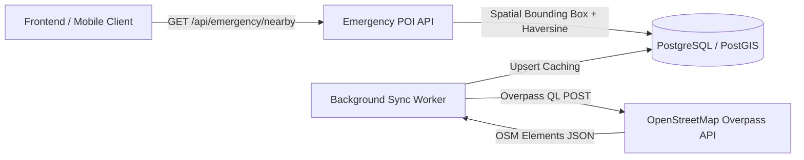

# Emergency POI Module — Rakshak AI

The **Emergency POI Module** (Module 15) is an independent, high-performance geospatial intelligence service for finding nearby emergency infrastructure (**Police Stations**, **Hospitals & Trauma Centers**, **Fire Stations**, and **24x7 Pharmacies**).

---

## 🏛️ Architecture & Data Sourcing



1. **Decoupled Data Ownership**: Owns the `emergency_pois` database table. Never imports logic from Route, Crime, or User modules.
2. **OpenStreetMap Overpass API Sync Engine**: Queries OpenStreetMap via Overpass QL for `amenity=police`, `amenity=hospital`, `amenity=fire_station`, and `amenity=pharmacy`.
3. **Database Caching**: Overpass API is rate-limited and slow; results are cached in the local database table and updated via background jobs or admin triggers.
4. **Spatial Radius Query**: Uses PostGIS bounding-box indexing + Haversine distance calculations, sorted strictly by `distanceKm` ascending.

---

## 📡 API Reference

### 1. Find Nearby Emergency POIs
```http
GET /api/emergency/nearby?lat=28.61&lng=77.20&radiusKm=3&type=police&limit=10
```

#### Query Parameters:
| Parameter | Type | Required | Default | Description |
| :--- | :---: | :---: | :---: | :--- |
| `lat` | float | Yes | — | Center point latitude (e.g. `28.6139`) |
| `lng` | float | Yes | — | Center point longitude (e.g. `77.2090`) |
| `radiusKm` | float | No | `5.0` | Search radius in kilometers |
| `type` | string | No | `null` | Filter: `police`, `hospital`, `fire_station`, `pharmacy` |
| `limit` | int | No | `50` | Maximum POIs to return |

#### Sample Response:
```json
[
  {
    "id": 1,
    "name": "Connaught Place Police Station",
    "type": "police",
    "latitude": 28.6328,
    "longitude": 77.2195,
    "phone": "011-23340555",
    "city": "Delhi",
    "source": "Overpass API (OSM)",
    "distanceKm": 1.22
  },
  {
    "id": 6,
    "name": "AIIMS New Delhi (Apex Trauma Center)",
    "type": "hospital",
    "latitude": 28.5672,
    "longitude": 77.2100,
    "phone": "011-26588500",
    "city": "Delhi",
    "source": "Overpass API (OSM)",
    "distanceKm": 4.15
  }
]
```

---

## 🔄 How to Trigger a Re-Sync

### Method A: Via REST API
You can trigger an on-demand re-sync for any city / coordinate zone:
```bash
curl -X POST "http://localhost:8000/api/emergency/sync" \
     -H "Content-Type: application/json" \
     -d '{
       "city": "Delhi",
       "lat": 28.6139,
       "lng": 77.2090,
       "radiusKm": 15.0,
       "forceSeed": false
     }'
```

### Method B: Via CLI Script / Cron Job
Run the background synchronizer directly:
```bash
python -c "
import asyncio
from app.database import AsyncSessionLocal
from app.overpass_sync import sync_emergency_pois_for_city

async def main():
    async with AsyncSessionLocal() as db:
        res = await sync_emergency_pois_for_city(db, city='Delhi', radius_km=20.0)
        print('Sync complete:', res)

asyncio.run(main())
"
```

---

## 🗄️ Database Schema (`emergency_pois`)

```sql
CREATE TABLE emergency_pois (
    id SERIAL PRIMARY KEY,
    name VARCHAR(200) NOT NULL,
    type VARCHAR(50) NOT NULL, -- 'police' | 'hospital' | 'fire_station' | 'pharmacy'
    latitude DOUBLE PRECISION NOT NULL,
    longitude DOUBLE PRECISION NOT NULL,
    phone VARCHAR(50),
    city VARCHAR(50) DEFAULT 'Delhi',
    source VARCHAR(100) DEFAULT 'Overpass API (OSM)',
    created_at TIMESTAMP WITH TIME ZONE DEFAULT NOW(),
    updated_at TIMESTAMP WITH TIME ZONE DEFAULT NOW()
);

CREATE INDEX idx_emergency_pois_lat_lon ON emergency_pois (latitude, longitude);
CREATE INDEX idx_emergency_pois_type ON emergency_pois (type);
CREATE INDEX idx_emergency_pois_city ON emergency_pois (city);
```
