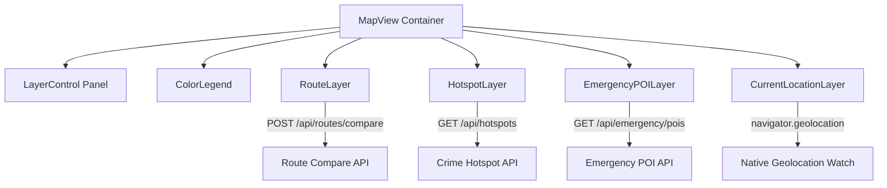

# Map Intelligence Layer — Rakshak AI

The **Map Intelligence Layer** is a standalone, decoupled frontend rendering module built with **React** and **Leaflet (OpenStreetMap / Carto tiles)**. It consumes spatial data from Route Compare, Hotspot, and Emergency POI APIs, rendering them as independently toggleable layers on an interactive map.

---

## 🏗️ Architecture & Module Independence

Each layer is an independent React component that manages its own data fetching, loading states, and caching:
- **Zero cross-layer coupling**: A layer component never reaches into or alters another layer's state.
- **Local visibility control**: The `LayerControl` checkbox list toggles layer visibility via React state without re-fetching network data.
- **Lazy-loading**: Heavy layers (`HotspotLayer`, `EmergencyPOILayer`) only fetch data when toggled **ON** for the first time.



---

## 🎨 Unified Risk Color Palette (`riskColors.js` / `riskColors.ts`)

All layers import the exact same color constants to ensure 100% visual consistency:

| Risk Level | Emoji | Hex Code | Safety Score Range | Description |
| :--- | :---: | :---: | :---: | :--- |
| **LOW** | 🟢 | `#10B981` | 80 – 100 | Safe baseline corridor, minimal crime reports |
| **MEDIUM** | 🟡 | `#EAB308` | 60 – 79 | Moderate activity, exercise standard vigilance |
| **HIGH** | 🟠 | `#F97316` | 40 – 59 | Elevated risk frequency, caution advised |
| **CRITICAL** | 🔴 | `#EF4444` | 0 – 39 | High crime cluster / active surveillance zone |

---

## 🗺️ Rendered Layers

### 1. `RouteLayer`
- Renders segmented route polylines colored dynamically by risk level per segment (Green / Yellow / Orange / Red).
- Displays interactive route comparison options (**Safest**, **Fastest**, **Balanced**).
- Renders start 🟢 and destination 🏁 markers with metric badges.

### 2. `HotspotLayer`
- Fetches from `GET /api/hotspots`.
- Renders `CircleMarker` circles:
  - Radius scaled smoothly by `crimeCount`: $r = \max(10, \min(34, 8 + 3.8 \cdot \sqrt{\text{count}}))$.
  - Color-coded by `riskLevel`.
  - Rich interactive popup with incident count and warning advice.

### 3. `EmergencyPOILayer`
- Fetches from `GET /api/emergency/pois`.
- Renders high-visibility custom icon markers:
  - 👮 **Police Stations**: Blue badge with direct dial action
  - 🏥 **24x7 Hospitals**: Emerald medical cross with emergency trauma helpline
- One-click `tel:` emergency call links.

### 4. `CurrentLocationLayer`
- Live GPS tracking via browser `navigator.geolocation.watchPosition`.
- Renders pulsing live radar dot + dynamic accuracy circle.
- Recenter map viewport button on demand.

### 5. `LayerControl` & `ColorLegend`
- Glassmorphism dark-mode floating control card with checkbox list for all 4 layers.
- Shows live layer badge counts and quick "Show all / Hide all" actions.
- Expandable Color Legend explaining score bands and thresholds.

---

## 📦 Directory Structure

```
frontend/src/components/map/
├── MapView.tsx              # Master Leaflet map container
├── RouteLayer.tsx           # Multi-route segmented polylines
├── HotspotLayer.tsx         # DBSCAN crime density circles
├── EmergencyPOILayer.tsx    # Police & hospital markers
├── CurrentLocationLayer.tsx # Live GPS radar telemetry
├── LayerControl.tsx         # Checkbox visibility panel
├── ColorLegend.tsx          # Risk color legend component
├── riskColors.ts            # Shared TypeScript color constants
├── riskColors.js            # Shared JS runtime export
└── index.ts                 # Barrel exports
```
