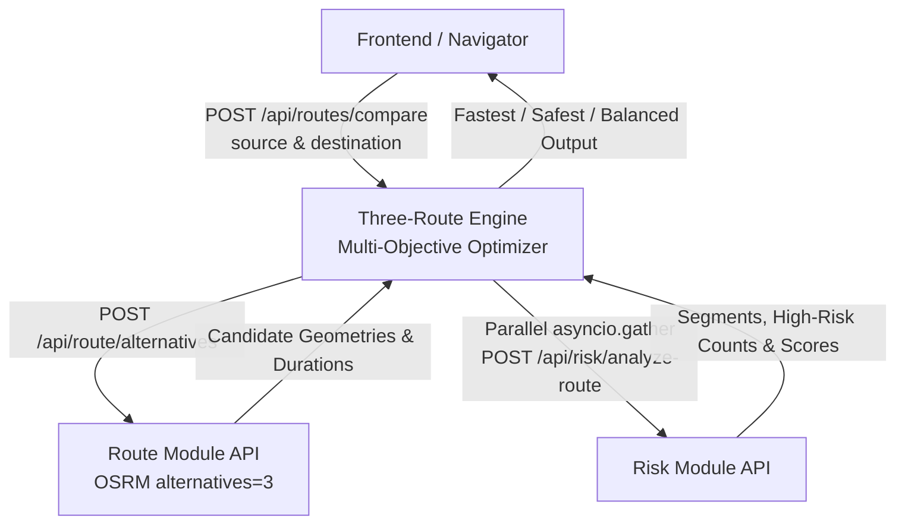

# Rakshak AI - Three-Route Comparison Engine

An orchestration microservice combining the **Route Module** (OSRM alternatives), **Risk Module** (polyline segmentation & hotspot queries), and a **Cost-Function Optimizer** to produce **Fastest**, **Safest**, and **Balanced** route options.

---

## 1. Architecture & Composition Flow



- **Pure Composition Layer**: Does NOT connect to database tables or query OSRM directly.
- **Graceful Degradation**: If OSRM returns fewer than 3 distinct alternatives (e.g. short trips), returns available alternatives without failing.
- **Parallelized Evaluation**: Executes risk and scoring calls concurrently for all alternatives using `asyncio.gather`.
- **5-Minute Caching**: Caches full 3-route comparisons per source/destination pair.

---

## 2. Cost-Function Formula & Classification

Each route candidate is evaluated across duration and safety:

### 1. Fastest Route
Alternative with minimum duration:
$$\text{Fastest} = \arg\min (\text{duration})$$

### 2. Safest Route
Alternative with maximum safety score:
$$\text{Safest} = \arg\max (\text{safetyScore})$$

### 3. Balanced Route
Alternative minimizing the combined multi-objective cost:
$$\text{normDuration} = \frac{\text{duration} - \min(\text{durations})}{\max(0.1, \max(\text{durations}) - \min(\text{durations}))}$$
$$\text{normSafetyRisk} = \frac{100.0 - \text{safetyScore}}{100.0}$$
$$\text{Cost} = (\text{normDuration} \times w_{\text{time}}) + (\text{normSafetyRisk} \times w_{\text{safety}})$$

*(Default weights: $w_{\text{time}} = 0.5, w_{\text{safety}} = 0.5$)*

---

## 3. API Contract

### `POST /api/routes/compare`

#### Request Body
```json
{
  "source": { "lat": 28.6692, "lng": 77.4538 },
  "destination": { "lat": 28.6139, "lng": 77.2090 }
}
```

#### Response (200 OK)
```json
{
  "fastest": {
    "distance": 32.4,
    "duration": 65.0,
    "safetyScore": 58.0,
    "highRiskSegments": 3,
    "geometry": [[77.4538, 28.6692], [77.2090, 28.6139]],
    "label": "Fastest Route",
    "description": "Shortest travel duration (65.0 mins), direct path."
  },
  "safest": {
    "distance": 36.2,
    "duration": 77.0,
    "safetyScore": 94.0,
    "highRiskSegments": 0,
    "geometry": [[77.4538, 28.6692], [77.3000, 28.7000], [77.2090, 28.6139]],
    "label": "Safest Route",
    "description": "Maximized safety score (94.0/100) prioritizing safe zones."
  },
  "balanced": {
    "distance": 33.1,
    "duration": 70.0,
    "safetyScore": 86.0,
    "highRiskSegments": 1,
    "geometry": [[77.4538, 28.6692], [77.3500, 28.6500], [77.2090, 28.6139]],
    "label": "Balanced Route",
    "description": "Optimized multi-objective trade-off (86.0 score, 70.0 mins)."
  },
  "evaluatedAlternativesCount": 3
}
```

---

## 4. Running Tests
```bash
pytest backend/tests/test_route_compare.py
```
