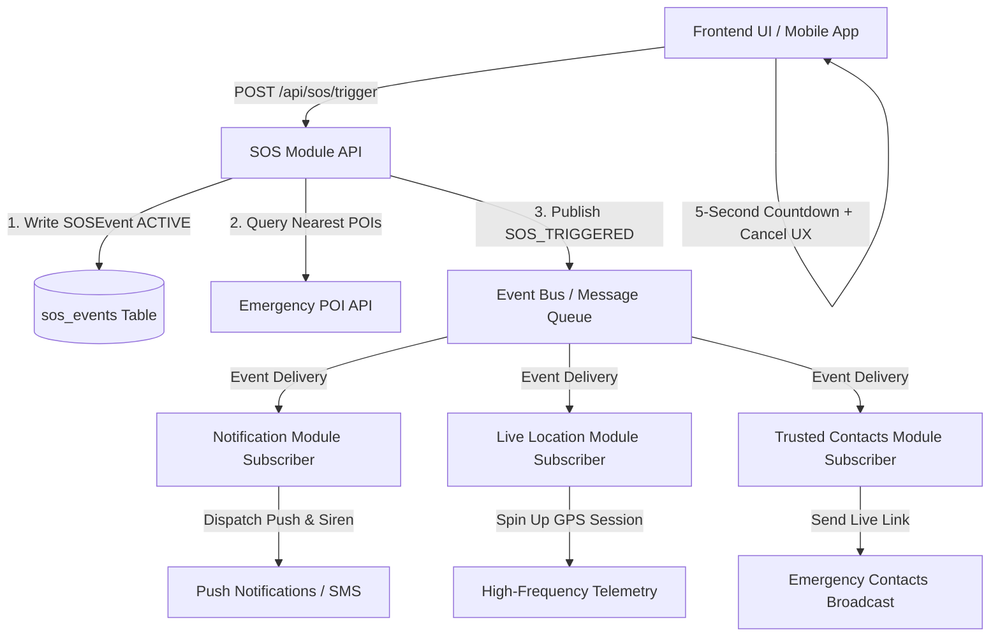

# SOS Module — Rakshak AI

The **SOS Module** is an independent, highly resilient emergency event service. It creates and tracks emergency SOS events, publishing lifecycle events to downstream subscribers (**Notification Service**, **Live Location Tracker**, **Trusted Contacts**) without sharing database tables or coupling domain logic.

---

## 🏛️ Pub/Sub Architecture & Event Publishing



### Key Architectural Tenets:
1. **Decoupled Data Isolation**: Owns only the `sos_events` table. Does not write to Notification, User, or Trusted Contacts tables directly.
2. **Event-Driven Pub/Sub**: Publishes `SOS_TRIGGERED`, `SOS_RESOLVED`, `SOS_CANCELLED`, and `SOS_STATUS_UPDATED` events via an asynchronous event bus.
3. **Production Upgrade Path**: While using a lightweight in-memory async event bus for development, in production this maps seamlessly to **Apache Kafka**, **RabbitMQ**, or **Redis Pub/Sub** topics.
4. **Emergency POI Enrichment**: On trigger, calls the **Emergency POI Module** (`/api/emergency/nearby`) to return the nearest police stations and 24x7 hospitals for immediate client rendering.

---

## ⏳ Client-Side Countdown Flow

To prevent accidental taps from generating false alarms:
1. When the user taps the SOS button, the frontend starts a **5-second countdown** accompanied by a distinct audible vibration/chime.
2. A prominent **"CANCEL SOS"** button allows the user to abort immediately before any backend request is dispatched.
3. If the countdown reaches `0`, the client issues the authenticated `POST /api/sos/trigger` request.

---

## 📡 API Reference

### 1. Trigger Emergency SOS
```http
POST /api/sos/trigger
Content-Type: application/json
Authorization: Bearer <user_token>

{
  "userId": "user_456",
  "latitude": 28.6139,
  "longitude": 77.2090,
  "emergencyType": "Immediate Threat / Harassment"
}
```

#### Response:
```json
{
  "sosId": "1",
  "status": "ACTIVE",
  "timestamp": "2026-09-11T02:00:00.000000Z",
  "userId": "user_456",
  "latitude": 28.6139,
  "longitude": 77.2090,
  "nearestEmergencyPois": [
    {
      "name": "Connaught Place Police Station",
      "type": "police",
      "latitude": 28.6328,
      "longitude": 77.2195,
      "distanceKm": 1.22,
      "phone": "011-23340555"
    }
  ],
  "message": "🚨 SOS Triggered. Emergency broadcast dispatched to Police & Trusted Contacts."
}
```

### 2. Resolve Emergency SOS
```http
POST /api/sos/1/resolve
```
Sets status to `RESOLVED`, timestamps `resolved_at`, and publishes `SOS_RESOLVED` event.

### 3. Update SOS Status
```http
PATCH /api/sos/1
Content-Type: application/json

{
  "status": "CANCELLED",
  "note": "User safely reached destination"
}
```

### 4. Query SOS Event Details
```http
GET /api/sos/1
```

---

## 🛡️ Security & Rate Limiting

- **Authentication Guard**: Verifies `Authorization` bearer token or user identification headers.
- **Sliding-Window Rate Limiter**: Limits requests to a maximum of **5 triggers per minute** per user to prevent denial-of-service or panic spamming.
