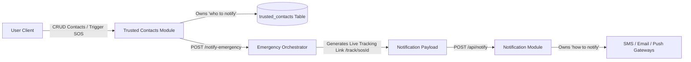

# Trusted Contacts Module — Rakshak AI

The **Trusted Contacts Module** manages a user's trusted emergency contact directory and orchestrates emergency dispatch notifications.

---

## 🏛️ Architecture & Separation of Concerns



### Key Architectural Tenets:
1. **Separation of "Who" vs "How"**:
   - **Trusted Contacts Module** owns *WHO to notify* (user contact list, relationships, priority).
   - **Notification Module** owns *HOW to notify* (SMS gateways, Email SMTP, Web Push, delivery retries).
2. **Strict Validation & Contact Cap**:
   - Validates mobile phone numbers and email syntax.
   - Enforces a sanity limit of **maximum 5 emergency contacts per user**.
3. **Emergency Orchestration (`/notify-emergency`)**:
   - Builds distress alert containing the real-time location tracking link: `https://rakshak-ai-frontend.onrender.com/track/{sosId}`.
   - Calls the Notification Module's `POST /api/notify` API.

---

## 📡 API Reference

### 1. Get User's Trusted Contacts
```http
GET /api/trusted-contacts?userId=user_123
```

### 2. Add New Trusted Contact
```http
POST /api/trusted-contacts
Content-Type: application/json

{
  "userId": "user_123",
  "name": "Pooja Sharma",
  "relationship": "Sister",
  "phone": "+91-9811223344",
  "email": "pooja.sharma@example.com"
}
```

### 3. Delete Trusted Contact
```http
DELETE /api/trusted-contacts/1
```

### 4. Orchestrate Emergency Notification Broadcast
```http
POST /api/trusted-contacts/notify-emergency
Content-Type: application/json

{
  "sosId": "1",
  "userId": "user_123"
}
```

#### Sample Response:
```json
{
  "status": "dispatched",
  "sosId": "1",
  "userId": "user_123",
  "recipientsCount": 2,
  "recipients": [
    {
      "name": "Rahul Sharma",
      "phone": "+91-9876543210",
      "email": "rahul.parent@example.com",
      "relationship": "Parent"
    },
    {
      "name": "Pooja Sharma",
      "phone": "+91-9811223344",
      "email": "pooja.sharma@example.com",
      "relationship": "Sister"
    }
  ],
  "liveTrackUrl": "https://rakshak-ai-frontend.onrender.com/track/1",
  "notificationDispatch": {
    "status": "dispatched",
    "dispatchedCount": 2,
    "channels": ["SMS", "EMAIL"]
  },
  "message": "Successfully queued emergency alerts to 2 trusted contact(s)."
}
```

---

## 🗄️ Database Model (`trusted_contacts`)

```python
class TrustedContact(Base):
    __tablename__ = "trusted_contacts"

    id = Column(Integer, primary_key=True, index=True, autoincrement=True)
    user_id = Column(String(100), nullable=False, index=True)
    name = Column(String(100), nullable=False)
    relationship = Column(String(50), nullable=True)  # Parent, Sibling, Spouse, Friend, Guardian
    phone = Column(String(30), nullable=False)
    email = Column(String(150), nullable=True)
    created_at = Column(DateTime(timezone=True), server_default=func.now())
    updated_at = Column(DateTime(timezone=True), server_default=func.now(), onupdate=func.now())
```
